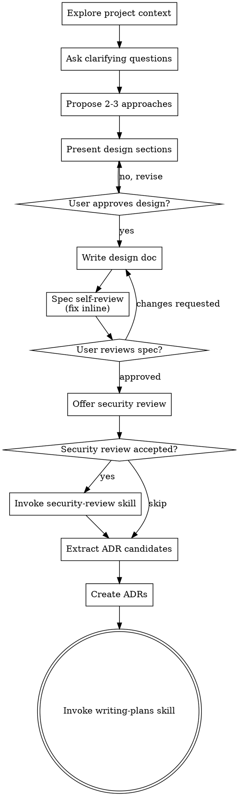

# Brainstorming Ideas Into Designs

Help turn ideas into fully formed designs and specs through natural collaborative dialogue.

Start by understanding the current project context, then ask questions one at a time to refine the idea. Once you understand what you're building, present the design and get user approval.

<HARD-GATE>
Do NOT invoke any implementation skill, write any code, scaffold any project, or take any implementation action until you have presented a design and the user has approved it. This applies to EVERY project regardless of perceived simplicity.
</HARD-GATE>

## Anti-Pattern: "This Is Too Simple To Need A Design"

Every project goes through this process. A todo list, a single-function utility, a config change — all of them. "Simple" projects are where unexamined assumptions cause the most wasted work. The design can be short (a few sentences for truly simple projects), but you MUST present it and get approval.

## Checklist

You MUST create a task for each of these items and complete them in order:

1. **Explore project context** — check files, docs, recent commits
2. **Offer the visual companion just-in-time** — NOT upfront. The first time a question would genuinely be clearer shown than described, offer it then (its own message); on approval its browser tab opens for you. If no visual question ever arises, never offer it. See the Visual Companion section below.
3. **Ask clarifying questions** — invoke the `ask` skill for all clarifying questions; one at a time, multiple choice, with a recommended answer
4. **Propose 2-3 approaches** — with trade-offs and your recommendation
5. **Recommend tech stack** — for each approach, recommend specific technologies and their latest versions (see Tech Stack Recommendations below)
6. **Present design** — in sections scaled to their complexity, get user approval after each section
7. **Write design doc** — save to `docs/superpowers/specs/YYYY-MM-DD-<topic>-design.md` and commit
8. **Spec self-review** — quick inline check for placeholders, contradictions, ambiguity, scope (see below)
9. **User reviews written spec** — ask user to review the spec file before proceeding
10. **Security review** — offer to threat-model the spec before implementation locks in architecture (see Security Review below)
11. **Extract and create ADRs** — scan approved spec for architectural decisions and create an ADR for every qualifying decision — this step is mandatory (see ADR Extraction below)
12. **Transition to implementation** — invoke writing-plans skill to create implementation plan

## Process Flow

**The terminal state is invoking writing-plans.** Do NOT invoke frontend-design, mcp-builder, or any other implementation skill. The ONLY skill you invoke after brainstorming is writing-plans.

## The Process

**Understanding the idea:**

- Check out the current project state first (files, docs, recent commits)
- Before asking detailed questions, assess scope: if the request describes multiple independent subsystems (e.g., "build a platform with chat, file storage, billing, and analytics"), flag this immediately. Don't spend questions refining details of a project that needs to be decomposed first.
- If the project is too large for a single spec, help the user decompose into sub-projects: what are the independent pieces, how do they relate, what order should they be built? Then brainstorm the first sub-project through the normal design flow. Each sub-project gets its own spec → plan → implementation cycle.
- For appropriately-scoped projects, invoke the `ask` skill for all clarifying questions — one at a time, multiple choice, with a recommended answer marked. Never ask open-ended questions when a structured choice is possible.
- Only one question per message — if a topic needs more exploration, break it into multiple questions
- Focus on understanding: purpose, constraints, success criteria

**Exploring approaches:**

- Propose 2-3 different approaches with trade-offs
- Present options conversationally with your recommendation and reasoning
- Lead with your recommended option and explain why
- For each approach, follow immediately with a tech stack recommendation (see Tech Stack Recommendations below)

**Presenting the design:**

- Once you believe you understand what you're building, present the design
- Scale each section to its complexity: a few sentences if straightforward, up to 200-300 words if nuanced
- Ask after each section whether it looks right so far
- Cover: architecture, components, data flow, error handling, testing
- Be ready to go back and clarify if something doesn't make sense

**Design for isolation and clarity:**

- Break the system into smaller units that each have one clear purpose, communicate through well-defined interfaces, and can be understood and tested independently
- For each unit, you should be able to answer: what does it do, how do you use it, and what does it depend on?
- Can someone understand what a unit does without reading its internals? Can you change the internals without breaking consumers? If not, the boundaries need work.
- Smaller, well-bounded units are also easier for you to work with - you reason better about code you can hold in context at once, and your edits are more reliable when files are focused. When a file grows large, that's often a signal that it's doing too much.

**Prefer flat structure over nested folders:**

- Place files in the project root by default. Only introduce a subdirectory when the number of files in a single concern genuinely warrants grouping — not preemptively.
- A new subdirectory is a structural commitment that outlives the feature. Do not create one to satisfy a sense of organisation; create one when the root is already crowded with related files.
- Never mirror a subdirectory structure from a convention (e.g. `src/`, `lib/`, `app/`) unless the existing codebase already uses it. Adding empty scaffolding folders is never justified.

**Working in existing codebases:**

- Explore the current structure before proposing changes. Follow existing patterns.
- Where existing code has problems that affect the work (e.g., a file that's grown too large, unclear boundaries, tangled responsibilities), include targeted improvements as part of the design - the way a good developer improves code they're working in.
- Don't propose unrelated refactoring. Stay focused on what serves the current goal.

## Tech Stack Recommendations

For each proposed approach, recommend the specific technologies that best fit it. This is not a generic list — it must be matched to the approach's constraints and trade-offs.

**Always recommend the latest stable version.** Never recommend an outdated version because it is familiar or because training data skews toward it.

<HARD-GATE>
If you are not certain what the latest stable version of a technology is, you MUST perform a web search before making the recommendation. Do not guess. Do not rely on training data for version numbers — it is always potentially stale. A recommendation with a wrong version is worse than no recommendation.
</HARD-GATE>

**What to cover per approach:**

- **Language/runtime** — with version (e.g., Node.js 22 LTS, Python 3.13, Go 1.23)
- **Framework** — with version (e.g., Next.js 15, FastAPI 0.115, Django 5.1)
- **Database** — with version and rationale for the choice
- **Key libraries** — only those central to the architecture, with versions
- **Tooling** — package manager, build tool, test runner (with versions where relevant)

**Format per approach:**

> **Approach 1 — [name]**
> Stack: Next.js 15 (React 19) · TypeScript 5.7 · PostgreSQL 17 · Prisma 6 · Vitest 2
> Rationale: [one sentence on why this stack fits this approach]

**Greenfield vs existing codebase:**

- **Greenfield:** Recommend the stack freely based on the best fit for the problem.
- **Existing codebase:** The existing stack is a hard constraint. Recommend additions or upgrades only — never suggest replacing a core technology that is already in use unless the user has explicitly raised it as a problem.

**Version sources (in order of reliability):**

1. Official release pages / changelogs (search: `[technology] latest stable release`)
2. Package registry (npmjs.com, pypi.org, crates.io, pkg.go.dev)
3. GitHub releases tab for the project

If a web search returns conflicting information, prefer the official project source over third-party articles.

## After the Design

**Documentation:**

- Write the validated design (spec) to `docs/superpowers/specs/YYYY-MM-DD-<topic>-design.md`
  - (User preferences for spec location override this default)
- Use elements-of-style:writing-clearly-and-concisely skill if available
- Commit the design document to git

**Spec Self-Review:**
After writing the spec document, look at it with fresh eyes:

1. **Placeholder scan:** Any "TBD", "TODO", incomplete sections, or vague requirements?
2. **Internal consistency:** Do any sections contradict each other? Does the architecture match the feature descriptions?
3. **Scope check:** Is this focused enough for a single implementation plan, or does it need decomposition?
4. **Ambiguity check:** Could any requirement be interpreted two different ways?

For each issue found, classify it:

- **Self-resolvable:** The answer follows unambiguously from what the user already told you (a missing diagram label, an implied constraint that isn't written down). Fix it inline.
- **Requires user input:** The answer involves a preference, a trade-off, or a decision the user hasn't made yet. **Do not guess. Do not pick one and move on.** Ask the user.

<HARD-GATE>
Do NOT proceed to the User Review Gate with any unresolved ambiguity, placeholder, or contradiction. Every open question must be answered — either by you (if self-resolvable) or by the user (if it requires their input). A spec with deferred decisions is not a spec.
</HARD-GATE>

If user input is needed, present all open questions together in a single message (not one at a time — the user has already been through the question phase). Once answered, update the spec and re-run the self-review before proceeding.

**User Review Gate:**
After the spec review loop passes, ask the user to review the written spec before proceeding:

> "Spec written and committed to `<path>`. Please review it and let me know if you want to make any changes before we start writing out the implementation plan."

Wait for the user's response. If they request changes, make them and re-run the spec review loop. Only proceed once the user approves.

**Security Review:**

After spec approval, offer a security review before writing the implementation plan. This is the cheapest moment to catch architectural security flaws — before they become load-bearing code.

Offer it as its own message:

> "Before we write the implementation plan, I can threat-model the design — check trust boundaries, auth flow, and data handling. Worth a few minutes now vs a refactor later. Want me to?"

If accepted, invoke `superpowers:security-review`. If the review surfaces a critical or high finding that requires a design change, re-run the spec approval gate before proceeding. If accepted findings are implementation constraints only (e.g., "hash passwords"), they are written into the spec and captured as tasks in writing-plans.

If declined or the design has no sensitive data or auth requirements, skip and proceed to ADR extraction.

**ADR Extraction:**

After spec approval, scan the spec document for architectural decisions and create an ADR for every qualifying decision. This step is not optional — do not ask the user whether to create ADRs, and do not skip it.

<HARD-GATE>
Every qualifying architectural decision MUST have an ADR created before proceeding to writing-plans. Do not present a list and ask for confirmation. Do not offer a skip path. Identify the decisions, create the ADRs, report what was created.
</HARD-GATE>

What qualifies as a decision:
- Technology or library choices with trade-offs ("use Postgres over SQLite because...")
- Architectural patterns selected ("event-driven over request-response because...")
- Explicit constraint decisions ("no external dependencies because...")
- Data model choices that have long-term implications

What does NOT qualify:
- Exploratory discussion that was rejected
- Implementation details with no real alternatives
- "TBD" items or deferred choices

Invoke `ruflo-adr:adr-create` for each qualifying decision, passing the title, context, decision, and alternatives from the spec. If `ruflo-adr` is not available, write ADR files manually to `docs/decisions/NNNN-<slug>.md` using the MADR format (Status / Context / Decision / Consequences).

Once all ADRs are created, report to the user: "Created N ADRs: [titles]. Proceeding to implementation plan."

**Implementation:**

- Invoke the writing-plans skill to create a detailed implementation plan
- Do NOT invoke any other skill. writing-plans is the next step.

## Key Principles

- **One question at a time** - Don't overwhelm with multiple questions
- **Multiple choice preferred** - Easier to answer than open-ended when possible
- **YAGNI ruthlessly** - Remove unnecessary features from all designs
- **Explore alternatives** - Always propose 2-3 approaches before settling
- **Incremental validation** - Present design, get approval before moving on
- **Be flexible** - Go back and clarify when something doesn't make sense

## Visual Companion

A browser-based companion for showing mockups, diagrams, and visual options during brainstorming. Available as a tool — not a mode. Accepting the companion means it's available for questions that benefit from visual treatment; it does NOT mean every question goes through the browser.

**Offering the companion (just-in-time):** Do NOT offer it upfront. Wait until a question would genuinely be clearer shown than told — a real mockup / layout / diagram question, not merely a UI *topic*. The first time that happens, offer it then, as its own message:
> "This next part might be easier if I show you — I can put together mockups, diagrams, and comparisons in a browser tab as we go. It's still new and can be token-intensive. Want me to? I'll open it for you."

**This offer MUST be its own message.** Only the offer — no clarifying question, summary, or other content. Wait for the user's response. If they accept, start the server with `--open` so their browser opens to the first screen automatically. If they decline, continue text-only and don't offer again unless they raise it.

**Per-question decision:** Even after the user accepts, decide FOR EACH QUESTION whether to use the browser or the terminal. The test: **would the user understand this better by seeing it than reading it?**

- **Use the browser** for content that IS visual — mockups, wireframes, layout comparisons, architecture diagrams, side-by-side visual designs
- **Use the terminal** for content that is text — requirements questions, conceptual choices, tradeoff lists, A/B/C/D text options, scope decisions

A question about a UI topic is not automatically a visual question. "What does personality mean in this context?" is a conceptual question — use the terminal. "Which wizard layout works better?" is a visual question — use the browser.

If they agree to the companion, read the detailed guide before proceeding:
`skills/brainstorming/visual-companion.md`
