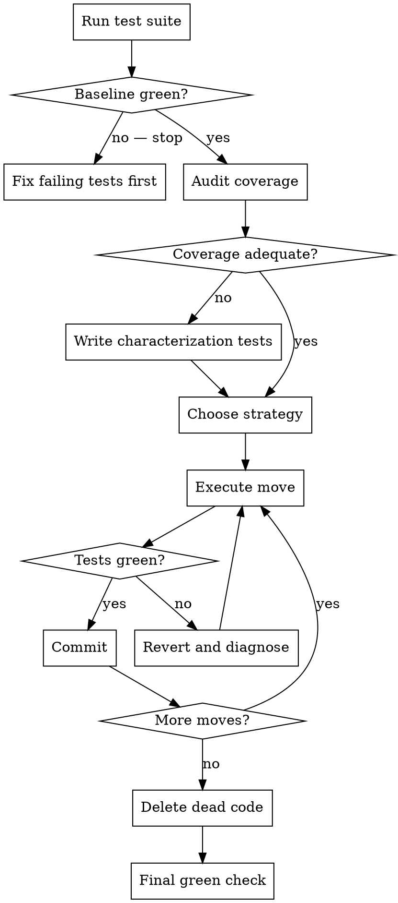

# Refactoring

## Overview

Refactoring changes structure, not behavior. The test suite is your proof that behavior is preserved. If the tests don't cover the code you're restructuring, you have no proof.

**Core principle:** Coverage before restructuring. Green at every commit. No behavior changes.

**Violating the letter of this process is violating the spirit of refactoring.**

## The Iron Law

```
NO RESTRUCTURING WITHOUT COVERAGE VERIFICATION FIRST
```

If you haven't confirmed tests cover the behavior you're changing, you cannot start. Writing new tests for existing behavior (characterization tests) is required, not optional.

## When to Use

- Decomposing a file that has grown too large
- Extracting a module or class with a cleaner boundary
- Renaming a domain concept consistently across the codebase
- Eliminating duplication across multiple files
- Clarifying interfaces without changing them

**Not refactoring — do not use this skill for:**
- Adding features (use brainstorming → writing-plans)
- Fixing bugs (use systematic-debugging)
- Performance optimization (the observable behavior changes — latency is behavior)

## Anti-Pattern: "I'll Just Clean This Up While I'm Here"

Mixing refactoring with feature work is how behavior changes slip through undetected. If you're implementing a feature and notice code that needs restructuring, **stop**. Commit the feature. Then start a separate refactoring session. Never both in the same commit.

## The Process

### Phase 1: Coverage Audit

Before touching any code:

1. Run the full test suite — establish a green baseline
2. Identify every file you intend to restructure
3. For each file, assess test coverage of its public behavior:
   - Are the primary code paths exercised by tests?
   - Are edge cases and error paths covered?
   - If coverage tooling is available, run it: `npx jest --coverage`, `go test -cover`, `pytest --cov`
4. If coverage gaps exist for behavior you're moving: **write characterization tests first**

**Characterization tests** capture what the code *currently does*, not what it *should* do. They are not TDD — you're documenting existing behavior, not specifying new behavior. Write the minimum needed to give you confidence the restructure doesn't break anything.

Only proceed to Phase 2 when you have a green baseline with adequate coverage.

### Phase 2: Choose Strategy

**Strangler Fig** (incremental, lower risk):
- Build the new structure alongside the old
- Migrate call sites one at a time
- Delete old code only after all callers are migrated
- Each step is independently deployable
- Use when: the code is called from many places, you can't refactor atomically, or the risk of a big-bang failure is high

**Big-Bang** (faster, higher risk):
- Restructure entirely in one pass
- All call sites updated in the same session
- Use when: the file is self-contained, callers are few and known, the change is purely mechanical

Default to strangler fig unless the scope is small and fully contained.

### Phase 3: Execute

Rules that apply to every commit during a refactoring session:

1. **Tests must be green before and after every commit** — if they go red, stop and fix before continuing
2. **No behavior changes** — if you find a bug while refactoring, note it, do not fix it in this session
3. **No feature additions** — if you see a missing feature, note it, do not add it
4. **Commits are atomic structural moves** — "extract UserValidator from UserService", not "refactor user code"
5. **One concern per commit** — moving a function and renaming it are two commits, not one



### Phase 4: Cleanup

After all moves are complete and tests are green:

1. Delete any dead code that is no longer reachable (stale exports, unused imports, old interfaces)
2. Run the full test suite one final time
3. Review the diff — does it read as pure structural change with no behavior delta?
4. If anything in the diff surprises you, investigate before committing

## Forbidden Actions

**NEVER during a refactoring session:**
- Change what a function returns or how it handles errors (that's a behavior change)
- Add a new parameter to a function (that's a feature)
- Remove a parameter from a public interface (that's a breaking change — handle separately)
- Fix a bug you notice (note it in a comment or TODO, fix it after this session)
- "Improve" logic while moving it — move it exactly as-is first, improve it separately

## Commit Message Convention

Refactoring commits should be unmistakably structural:

```
refactor: extract PaymentValidator from PaymentService
refactor: rename UserAccount → Account across codebase
refactor: decompose order.ts into order/, item/, fulfillment/
```

Never: `refactor: clean up user code` — this is too vague to review.

## Key Principles

- **Coverage before structure** — no characterization tests, no refactoring
- **Green at every commit** — a red commit during refactoring means you changed behavior
- **Note, don't fix** — bugs found during refactoring are logged, not fixed in the same session
- **One move per commit** — reviewers should be able to verify each commit is purely structural
