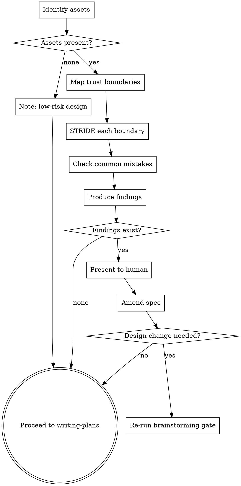

# Security Review

## Overview

Security flaws found at design time cost a comment. Security flaws found at code review cost a refactor. Security flaws found in production cost everything.

This skill reviews the **spec**, not the code. It applies during brainstorming's post-approval window — after the design is confirmed but before `writing-plans` locks in the architecture. Code-level security review belongs in `requesting-code-review`.

**Core principle:** Threat-model the design first. Find architectural security gaps before they become load-bearing code.

## When to Use

**Primary trigger:** After the user approves the spec in brainstorming, before invoking writing-plans. Offer it alongside ADR extraction:

> "Before we write the implementation plan, I can do a quick security review of the design — threat model the trust boundaries, auth flow, and data handling. Worth 10 minutes now vs a refactor later. Want me to?"

**Secondary trigger:** Explicitly requested at any point ("can you security-review this design?").

**Do NOT use for:** Reviewing already-written code. Use `requesting-code-review` with a security prompt for that.

## The Iron Law

```
NO SECURITY FINDINGS WITHOUT EVIDENCE FROM THE SPEC
```

Every finding must cite a specific section, data flow, or decision in the spec. "This design might have auth issues" is not a finding. "Section 3 describes the API accepting user-supplied IDs without specifying ownership verification — an authenticated user could access another user's resources" is a finding.

## The Process

### Step 1: Identify Assets

What does this system protect? Read the spec and enumerate:

- **Data assets:** What sensitive data does the system store, process, or transmit? (PII, credentials, payment data, private content)
- **Functional assets:** What actions must be protected from unauthorized use? (admin operations, financial transactions, account modifications)
- **Availability:** Are there operations where downtime or abuse causes meaningful harm?

If the spec describes no sensitive data and no authorization requirements, state that explicitly — a security review on a public read-only utility is low value.

### Step 2: Map Trust Boundaries

A trust boundary is anywhere data crosses from a less-trusted to a more-trusted context, or where identity/permissions are assumed.

From the spec, identify:
- **Entry points:** Where does untrusted data enter the system? (API endpoints, file uploads, webhook payloads, environment variables)
- **Authentication boundaries:** Where does the system verify who is making a request?
- **Authorization boundaries:** Where does the system verify what they're allowed to do?
- **Service-to-service boundaries:** Does the design have internal services calling each other? On what trust basis?
- **Data persistence boundaries:** Where is sensitive data written to storage? Is it encrypted at rest?

Draw these explicitly — even as a mental map. Missing boundaries are where vulnerabilities live.

### Step 3: Threat Model (STRIDE)

For each entry point and boundary, ask:

| Threat | Question |
|--------|----------|
| **Spoofing** | Can an attacker impersonate a legitimate user or service? Does the auth mechanism verify identity robustly? |
| **Tampering** | Can an attacker modify data in transit or at rest? Is integrity verified? |
| **Repudiation** | Can a user deny performing an action? Is there an audit trail for sensitive operations? |
| **Information Disclosure** | Can an attacker read data they shouldn't? Are error messages leaking stack traces, IDs, or internal paths? |
| **Denial of Service** | Can an attacker exhaust resources? Are there rate limits on expensive operations? |
| **Elevation of Privilege** | Can a lower-privileged user perform higher-privileged actions? Is authorization checked at every layer, not just the entry point? |

You do not need a finding for every cell. Work through the model and only surface real gaps.

### Step 4: Check Common Architectural Mistakes

Regardless of the specific design, verify these are addressed in the spec:

**Authentication:**
- [ ] How are sessions or tokens invalidated on logout?
- [ ] Is there a mechanism for forced session invalidation (password change, account compromise)?
- [ ] Are credentials ever logged, stored in URLs, or exposed in client-side code?

**Authorization:**
- [ ] Is authorization enforced server-side, not just client-side?
- [ ] For resource access, does the spec describe ownership verification (not just authentication)?
- [ ] Are there admin/privileged operations? How are they gated?

**Data handling:**
- [ ] Is sensitive data (passwords, tokens, PII) described with appropriate storage treatment (hashing, encryption)?
- [ ] Does the spec describe data retention and deletion? (GDPR, CCPA implications if applicable)
- [ ] Are file uploads scoped to type and size? Where are they stored?

**Dependencies and integrations:**
- [ ] Does the design call external services? How are those credentials stored and rotated?
- [ ] Does the spec accept webhooks or callbacks? How are they verified as authentic?

### Step 5: Produce Findings

For each issue found, write a finding with:

- **Severity:** Critical / High / Medium / Low
- **Location:** Which section or data flow in the spec
- **Threat:** What can go wrong (cite STRIDE category)
- **Finding:** What specifically is missing or wrong in the design
- **Recommendation:** What the spec should say to address it

**Severity guide:**
- **Critical:** Unauthenticated access to sensitive data or operations; credential exposure
- **High:** Authenticated users can access other users' data; privilege escalation path exists
- **Medium:** Missing rate limiting on sensitive operations; verbose error messages; missing audit trail
- **Low:** Defense-in-depth gaps; best practices missing but no direct exploit path

### Step 6: Present and Amend

Present findings to your human partner. For each finding accepted:

1. Amend the spec document directly — add a "Security Constraints" section or inline the requirement where the issue was found
2. If the finding requires a significant design change (e.g., adding an auth layer that wasn't in the design), flag it as a design revision and re-run the brainstorming approval gate
3. If the finding is a standard implementation requirement (e.g., "hash passwords with bcrypt"), add it as a constraint in the spec so writing-plans captures it as a task



## What This Skill Does Not Cover

- **Dependency CVE scanning** — run `npm audit`, `pip audit`, or `trivy` at implementation time
- **Code-level vulnerabilities** (injection, XSS, insecure deserialization) — these are implementation concerns; catch them with `requesting-code-review` after code is written
- **Penetration testing** — this is design analysis, not adversarial testing

## Key Principles

- **Design time is the cheapest time** — a spec comment costs nothing; a refactor costs a sprint
- **Evidence from the spec** — every finding cites where in the design the gap exists
- **Findings become spec constraints** — accepted findings are written into the spec, not just noted
- **Significant findings reopen design** — a critical finding is not a code-review comment; it's a design revision
