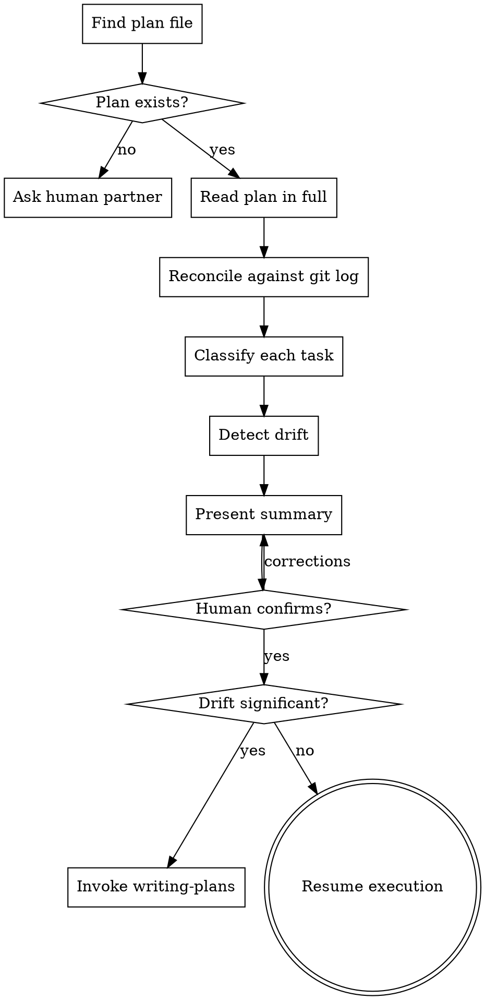

# Session Resume

## Overview

Plans are written before implementation starts. By the time you resume, reality has diverged. Tasks that looked independent may now conflict. Assumptions the plan made may have been invalidated. A task marked "todo" may already be half-done by an earlier task that went further than planned.

**Core principle:** Never trust the plan's task list without reconciling it against the git log. Stale state is the primary cause of duplicated work and contradictory changes across sessions.

## The Iron Law

```
NO TASK EXECUTION WITHOUT RECONCILIATION FIRST
```

If you haven't compared the plan's expected state against the actual git state, you cannot start executing. "I'll just check as I go" is how agents re-implement completed work or overwrite deliberate decisions.

## When to Use

- Starting a session on a multi-session project
- Resuming after context was lost mid-task
- Picking up a plan written by a different agent or a previous you
- Any time you load a plan and are not certain what has already been done

## The Process

### Step 1: Find the Plan

```bash
# Check the standard location first
ls docs/superpowers/plans/

# If not there, search
find . -name "*.md" -path "*/plans/*" | sort -r | head -10
```

If no plan exists: do not proceed as if one does. Ask your human partner how they want to approach the session — brainstorming to create a spec, or direct execution.

### Step 2: Read the Plan in Full

Read the entire plan before drawing any conclusions. Note:
- The overall goal
- Which tasks are explicitly marked complete, in-progress, or todo
- Any decisions or constraints documented in the plan
- The assumed starting state (what was true when the plan was written)

### Step 3: Reconcile Against Git

Read the git log from the point the plan was committed:

```bash
# Find when the plan file was committed
PLAN_FILE="docs/superpowers/plans/<filename>.md"
PLAN_SHA=$(git log --oneline --follow -- "$PLAN_FILE" | head -1 | awk '{print $1}')

# Show all commits since the plan was written
git log --oneline "$PLAN_SHA"..HEAD

# Show what files actually changed
git diff --stat "$PLAN_SHA"..HEAD
```

For each commit since the plan was written, assess:
- Does this commit complete a plan task? Which one?
- Does this commit partially complete a task? How far did it get?
- Does this commit invalidate a plan assumption?
- Does this commit introduce something the plan didn't account for?

### Step 4: Assess Each Task

Classify every task in the plan:

| Status | Meaning |
|--------|---------|
| `DONE` | Git evidence confirms this is complete |
| `PARTIAL` | Work started but not finished — identify exactly where it stopped |
| `TODO` | No git evidence this was touched |
| `INVALIDATED` | A completed task made this unnecessary or impossible as written |
| `BLOCKED` | Depends on something that failed or changed |

Do not rely on the plan's own status markers — verify against git. A task marked "todo" in the plan may have been completed without updating the plan. A task marked "done" may have been partially reverted.

### Step 5: Detect Drift

Drift is when reality diverged from what the plan assumed. Flag it explicitly:

**Scope drift:** A completed task went further than planned — it touched files the plan assigned to a later task.

**Assumption drift:** The plan assumed X (e.g., "the auth module is stateless") but the codebase now shows Y.

**Dependency drift:** Task B depended on Task A's output being a specific shape; Task A was completed but produced a different shape.

**Blocked path:** A dependency outside the plan (library update, API change, teammate's commit) broke the plan's path.

### Step 6: Present Summary and Confirm

Before executing anything, present a reconciliation summary to your human partner:

```
Session resume — reconciliation complete.

Completed (3): task-1, task-2, task-4
Partial (1):   task-3 — auth middleware scaffolded, routes not wired
Todo (2):      task-5, task-6
Invalidated:   task-7 — covered by task-4's implementation

Drift detected:
- task-3 touched routes.ts, which task-5 also modifies — review for conflicts
- Plan assumed SQLite, but task-2 migrated to Postgres — task-6 queries may need updating

Ready to resume at task-3 (partial). Proceed?
```

Wait for confirmation. If your human partner identifies issues with the reconciliation, resolve them before starting.

### Step 7: Resume or Replan

**If drift is minor** (one or two tasks need adjustment):
- Update task statuses in your task list
- Amend the plan file with a brief "Session 2 notes" section capturing what changed
- Proceed from the first incomplete task

**If drift is significant** (assumptions invalidated, multiple tasks blocked, scope changed):
- Do not attempt to execute the broken plan
- Invoke `superpowers:brainstorming` or `superpowers:writing-plans` to produce a revised plan
- The revised plan should reference the original and describe what changed



## Mid-Task Recovery

If a previous session died mid-task (partial file edits, uncommitted changes, broken tests):

```bash
# Check for uncommitted changes
git status
git diff
git stash list
```

1. If there are uncommitted changes: read them carefully — do they represent useful partial work or a broken state?
2. If broken (tests fail, code doesn't compile): stash or discard and restart the task cleanly
3. If useful partial work: commit what's complete, discard what isn't, note in the task where to resume

Never build on uncommitted partial work without explicitly deciding it is valid.

## Key Principles

- **Verify against git, not against the plan** — the plan's task markers may be stale
- **Classify before executing** — a 5-minute reconciliation prevents hours of duplicated work
- **Drift is normal, not failure** — implementation always reveals unknowns; the skill is surfacing them
- **Significant drift = new plan** — do not patch a broken plan; replace it
